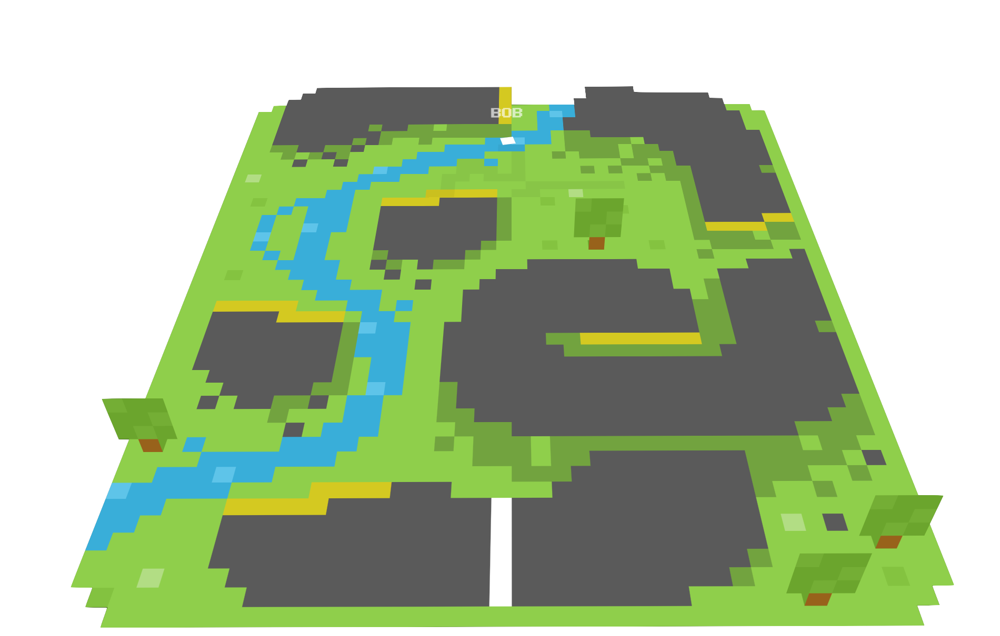

# pixelnode

### Startup Instructions
1. Run `npm install`.
2. Copy `sample.env` to `.env`: `cp sample.env .env`.
3. Change `PORT` in `.env` if you need to (it's 5000 by default).
4. Run `npm start`.
5. Browse to `http://host:port`, likely `http://localhost:5000`.